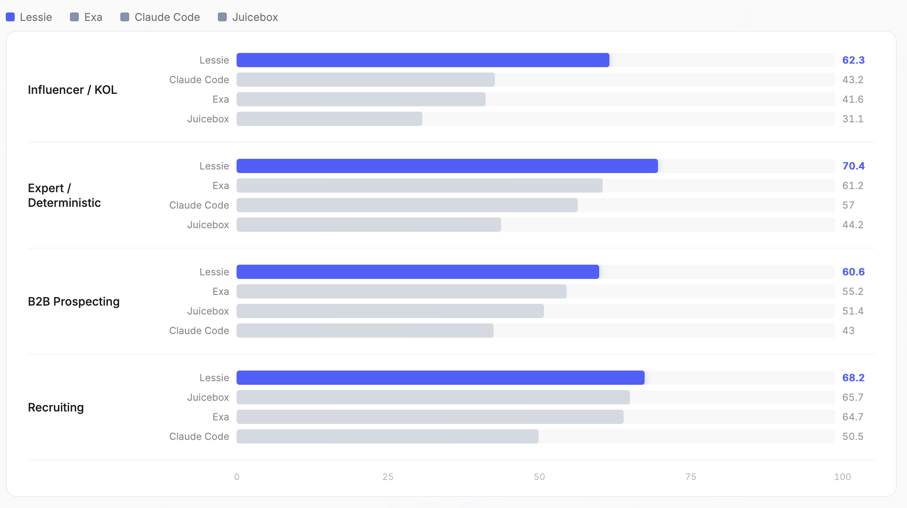

<p align="center">
  
</p>

<p align="center">
  <a href="https://arxiv.org/abs/2603.27476"></a>
  <a href="LICENSE"></a>
</p>

<p align="center">
  <a href="#leaderboard">Leaderboard</a> •
  <a href="#methodology">Methodology</a> •
  <a href="#case-studies">Case Studies</a> •
  <a href="#data--reproducibility">Reproducibility</a>
</p>

No existing benchmark measures how well AI can find real people from natural language queries. We built one: 119 queries, 4 scenarios, 3 scoring dimensions, all graded against web evidence — not LLM opinion. [Paper](https://arxiv.org/abs/2603.27476).

## Leaderboard

<p align="center">
  
</p>

| Platform | Relevance Precision | Effective Coverage | Information Utility | Overall |
|----------|:-------------------:|:------------------:|:-------------------:|:-------:|
| Lessie | 70.2 | 69.1 | 56.4 | 65.2 |
| Exa | 53.8 | 58.1 | 53.1 | 55.0 |
| Claude Code | 54.3 | 41.1 | 42.7 | 46.0 |
| Juicebox (PeopleGPT) | 44.7 | 41.8 | 50.9 | 45.8 |

<details>
<summary><b>How scores are computed</b></summary>

We extract checkable criteria from each query, verify each returned person against those criteria via web search (Tavily API), and produce a relevance grade (0–1) per person.

- **Relevance Precision** — padded nDCG@10. The ideal DCG assumes 10 perfect results exist, so returning 3 perfect results out of 3 still scores below a platform that returns 10.
- **Effective Coverage** — `TCR × mean(min(qualified / K, 1.0)) × 100`. Qualified = relevance grade >= 0.5.
- **Information Utility** — average of profile completeness, query-specific evidence, and actionability.
- **Overall** — equal-weight mean of the three.

**Platform notes:** Juicebox leads Coverage (75.3) and Utility (55.8) in Recruiting — its 800M-profile database pays off in that vertical, less so outside it. Claude Code gets decent Relevance but returns fewer results, dragging Coverage down. Relevance Precision uses padded nDCG@10: the ideal DCG always assumes 10 perfect results, so platforms returning fewer results are penalized.

</details>

<details>
<summary><b>Per-dimension breakdown by scenario</b></summary>

#### Relevance Precision

| Scenario | Lessie | Exa | Juicebox | Claude Code |
|----------|:------:|:---:|:--------:|:-----------:|
| Recruiting | 74.8 | 66.2 | 66.1 | 59.0 |
| B2B Prospecting | 62.8 | 50.0 | 46.1 | 43.0 |
| Expert / Deterministic | 79.0 | 61.6 | 39.0 | 69.6 |
| Influencer / KOL | 65.2 | 37.4 | 26.6 | 46.9 |

#### Effective Coverage

| Scenario | Lessie | Exa | Juicebox | Claude Code |
|----------|:------:|:---:|:--------:|:-----------:|
| Recruiting | 75.6 | 73.8 | 75.3 | 46.7 |
| B2B Prospecting | 63.5 | 58.5 | 52.7 | 42.3 |
| Expert / Deterministic | 75.2 | 69.0 | 46.9 | 62.9 |
| Influencer / KOL | 62.8 | 39.3 | 22.8 | 39.3 |

#### Information Utility

| Scenario | Lessie | Exa | Juicebox | Claude Code |
|----------|:------:|:---:|:--------:|:-----------:|
| Recruiting | 54.3 | 54.0 | 55.8 | 45.8 |
| B2B Prospecting | 55.5 | 57.0 | 55.4 | 43.6 |
| Expert / Deterministic | 57.1 | 52.9 | 46.8 | 38.5 |
| Influencer / KOL | 58.9 | 48.0 | 44.0 | 43.4 |

</details>

## Methodology

```
Query → Extract checkable criteria → Verify each person via web search → Grade → Aggregate
```

Each query is decomposed into concrete criteria. Each returned person is checked against those criteria using live web search — not the LLM's parametric memory. A person matching 2 of 3 criteria scores 0.67.

| Metric | How |
|:-------|:----|
| **Relevance Precision** | Padded nDCG@10 over per-person relevance grades |
| **Effective Coverage** | Task completion rate × qualified yield per query (capped at K=10) |
| **Information Utility** | Mean of completeness, evidence quality, and actionability |
| **Overall** | Equal-weight average |

**Why not LLM-as-Judge?** LLM-as-Judge scores are subjective, prompt-sensitive, and biased toward style over substance. We decompose into binary factual checks verified against live web sources — trading speed for reproducibility.

### Query Design

119 queries across 4 categories, in English, Portuguese, Spanish, and Dutch:

| Category | n | What it tests |
|----------|:-:|---------------|
| **Recruiting** | 30 | Skills + experience + location matching |
| **B2B Prospecting** | 32 | Finding decision-makers at target companies |
| **Expert / Deterministic** | 28 | Queries with verifiable correct answers |
| **Influencer / KOL** | 29 | Cross-platform creator discovery |

All queries available in [`data/queries/`](data/queries/).

### Platforms

| Platform | Type | What it searches |
|----------|------|-----------------|
| [Lessie](https://lessie.ai) | AI Agent | Web, social, professional, academic |
| [Exa](https://exa.ai) | Search API | Structured entity database |
| [Juicebox](https://juicebox.ai) | AI Recruiting | 800M+ professional profiles |
| [Claude Code](https://claude.ai) | General AI Agent | Web search |

## Case Studies

Eight queries evaluated outside the main benchmark to stress-test cross-domain edge cases.

<details>
<summary><b>Case 1: Rising Stars in LLM Safety & Alignment</b></summary>

*"Who are the rising stars in the large language model safety and alignment field? I want people who started publishing after 2021 and already have 3+ first-author papers at top venues."*

Cross-references publication databases with career profiles.

| Platform | Relevance | Coverage | Utility | Qualified |
|----------|:---------:|:--------:|:-------:|:---------:|
| Lessie | 100.0 | 100.0 | 28.9 | 15/15 |
| Claude Code | 79.6 | 73.3 | 52.5 | 11/12 |
| Juicebox | 71.7 | 86.7 | 54.0 | 13/15 |
| Exa | 65.1 | 93.3 | 42.7 | 14/15 |

</details>

<details>
<summary><b>Case 2: Brazilian Beauty Micro-Influencers on Instagram</b></summary>

*"Brazilian beauty niche influencers who talk about hair, hair loss, etc... with between 5k to 30k followers on Instagram, and who have a highly engaged audience"*

Five constraints at once: geography, platform, niche, follower range, engagement.

| Platform | Relevance | Coverage | Utility | Qualified |
|----------|:---------:|:--------:|:-------:|:---------:|
| Lessie | 99.1 | 100.0 | 33.3 | 15/15 |
| Exa | 67.0 | 86.7 | 39.8 | 13/15 |
| Claude Code | 59.7 | 46.7 | 23.3 | 7/7 |
| Juicebox | 22.8 | 6.7 | 25.8 | 1/15 |

</details>

<details>
<summary><b>Case 3: Tsinghua Grads in Bay Area AI</b></summary>

*"Find me top AI developers in Bay Area, and graduated from Tsinghua University after 2010"*

Tests alumni network data access across geography, profession, education, and time.

| Platform | Relevance | Coverage | Utility | Qualified |
|----------|:---------:|:--------:|:-------:|:---------:|
| Lessie | 97.8 | 100.0 | 29.6 | 15/15 |
| Claude Code | 78.6 | 46.7 | 1.0 | 7/7 |
| Juicebox | 76.2 | 93.3 | 33.3 | 14/15 |
| Exa | 69.0 | 80.0 | 33.3 | 12/15 |

</details>

<details>
<summary><b>Case 4: AI Agent Startup Founders (2025 Funded)</b></summary>

*"Map the key people behind the top AI agent startups funded in 2025. For each company give me the founding team, their backgrounds, and any shared alumni networks."*

Requires fusing venture funding data, company databases, and founder profiles.

| Platform | Relevance | Coverage | Utility | Qualified |
|----------|:---------:|:--------:|:-------:|:---------:|
| Claude Code | 92.5 | 100.0 | 30.2 | 15/15 |
| Lessie | 78.9 | 100.0 | 66.0 | 15/15 |
| Exa | 69.5 | 86.7 | 51.6 | 13/15 |
| Juicebox | 52.5 | 60.0 | 49.1 | 9/15 |

</details>

<details>
<summary><b>Case 5: Agricultural Scientists in Africa</b></summary>

*"Find agricultural scientists in Africa working on food security, crop science, or sustainable farming"*

Most of these people live in institutional databases, not LinkedIn.

| Platform | Relevance | Coverage | Utility | Qualified |
|----------|:---------:|:--------:|:-------:|:---------:|
| Exa | 97.6 | 100.0 | 61.8 | 15/15 |
| Claude Code | 96.8 | 80.0 | 13.6 | 12/12 |
| Juicebox | 94.8 | 100.0 | 66.4 | 15/15 |
| Lessie | 93.4 | 100.0 | 33.3 | 15/15 |

</details>

<details>
<summary><b>Case 6: NLP Academics Turned Industry Practitioners</b></summary>

*"Find people who have both a strong academic publication record in NLP and also hold senior engineering positions at tech companies."*

Two professional identities that rarely coexist in one data source.

| Platform | Relevance | Coverage | Utility | Qualified |
|----------|:---------:|:--------:|:-------:|:---------:|
| Juicebox | 100.0 | 100.0 | 33.3 | 15/15 |
| Lessie | 95.6 | 100.0 | 33.1 | 15/15 |
| Claude Code | 92.6 | 100.0 | 24.9 | 15/15 |
| Exa | 73.8 | 86.7 | 33.3 | 13/15 |

</details>

<details>
<summary><b>Case 7: Google DeepMind Talent Flow</b></summary>

*"Find engineers who recently mass-departed from Google DeepMind in the last 6 months and identify where they went."*

Temporal career tracking — who left, when, where they landed.

| Platform | Relevance | Coverage | Utility | Qualified |
|----------|:---------:|:--------:|:-------:|:---------:|
| Lessie | 100.0 | 100.0 | 60.2 | 15/15 |
| Claude Code | 92.3 | 86.7 | 22.6 | 13/13 |
| Juicebox | 44.4 | 66.7 | 34.4 | 10/15 |
| Exa | 37.8 | 73.3 | 34.4 | 11/15 |

</details>

<details>
<summary><b>Case 8: UK Film Prop Companies Needing CNC Services</b></summary>

*"Find me UK film prop or event prop companies who would require an outsourced CNC service"*

Niche B2B with an inferred need — the query never says "CNC" is a service these companies buy, the platform has to figure that out.

| Platform | Relevance | Coverage | Utility | Qualified |
|----------|:---------:|:--------:|:-------:|:---------:|
| Lessie | 87.5 | 100.0 | 56.9 | 15/15 |
| Juicebox | 66.7 | 60.0 | 52.2 | 9/15 |
| Exa | 53.7 | 66.7 | 56.0 | 10/15 |
| Claude Code | 19.3 | 6.7 | 0.0 | 1/1 |

</details>

## Data & Reproducibility

This repo contains the query set ([`data/queries/`](data/queries/)), evaluation methodology, and aggregated scores. Raw per-person results are excluded for privacy.

The pipeline: run queries → collect results as CSV → extract criteria per query → verify each person via web search → grade → aggregate into nDCG, Coverage, and Utility scores. Same pipeline, same LLM, applied identically to every platform.

## Disclosure

This benchmark is maintained by [LessieAI](https://lessie.ai), which is also one of the evaluated platforms. Everything is open-source. Scoring relies on external web verification, not our own models. We apply the same pipeline identically to all platforms. [Submit your results](docs/submission_guide.md) if you want to be included.

## Citation

```bibtex
@misc{lessieai2026peoplesearchbench,
  title={People Search Bench: A Benchmark for Evaluating AI-Powered People Search Agents},
  author={LessieAI},
  year={2026},
  eprint={2603.27476},
  archivePrefix={arXiv},
  url={https://arxiv.org/abs/2603.27476}
}
```

## Acknowledgments

Methodology builds on [MT-Bench](https://arxiv.org/abs/2306.05685) (Zheng et al., 2023), nDCG (Jarvelin & Kekalainen, 2002), and MCDA (Dawes, 1979). Web verification via [Tavily](https://tavily.com), LLM evaluation via [OpenRouter](https://openrouter.ai).
