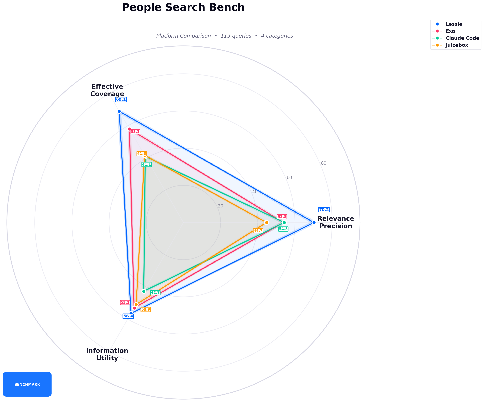
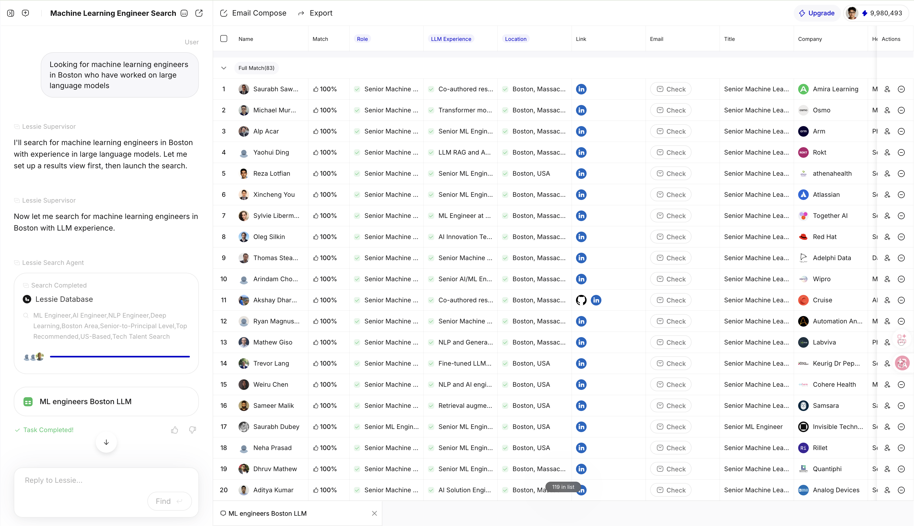
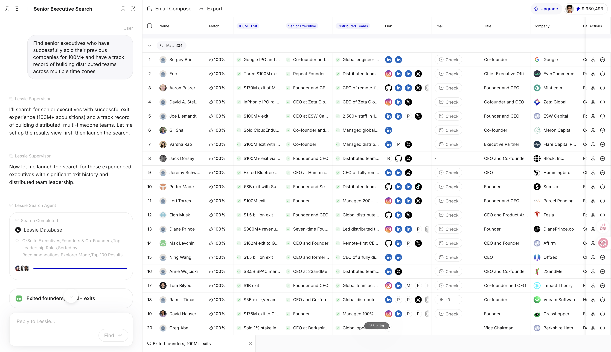
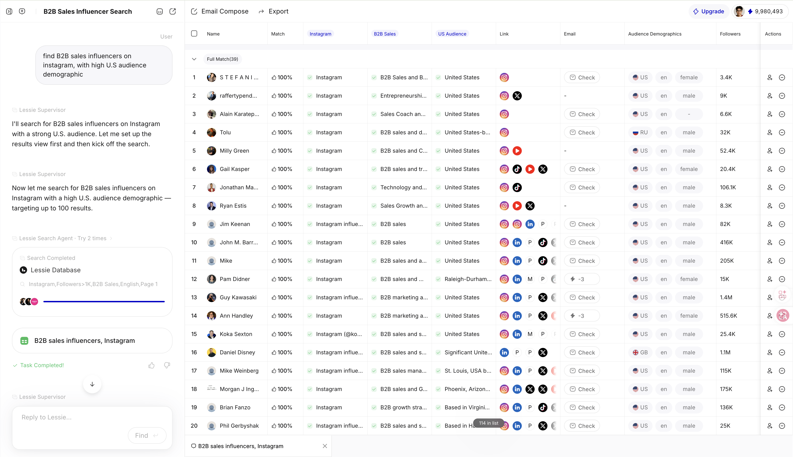
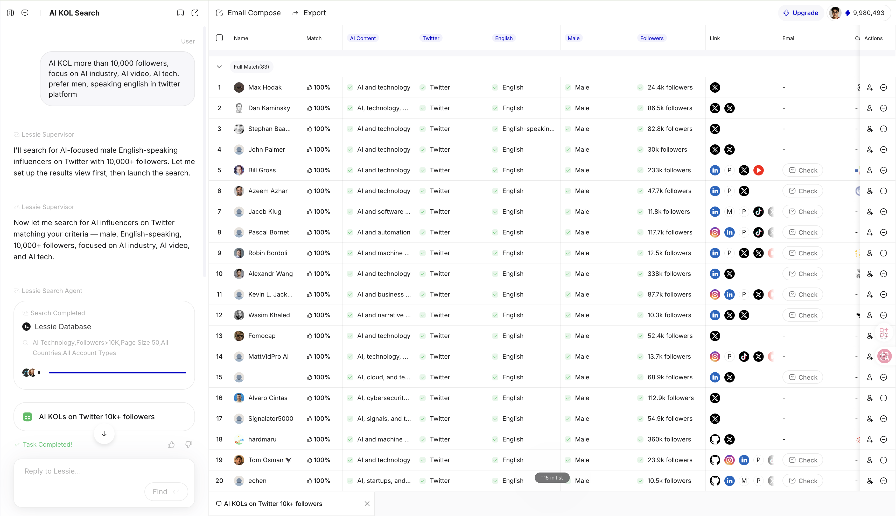
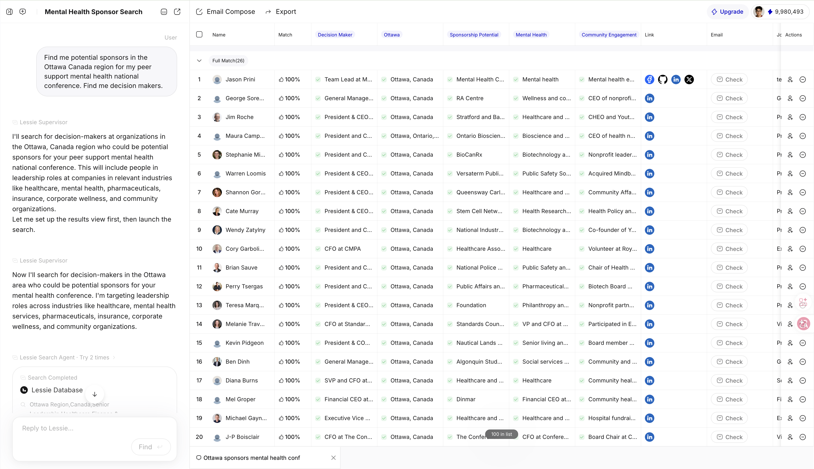
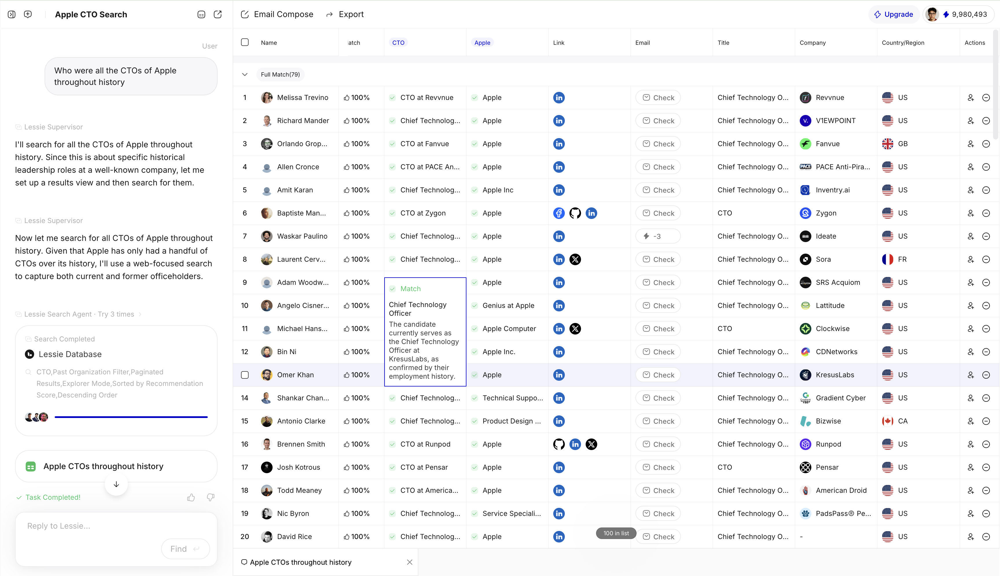
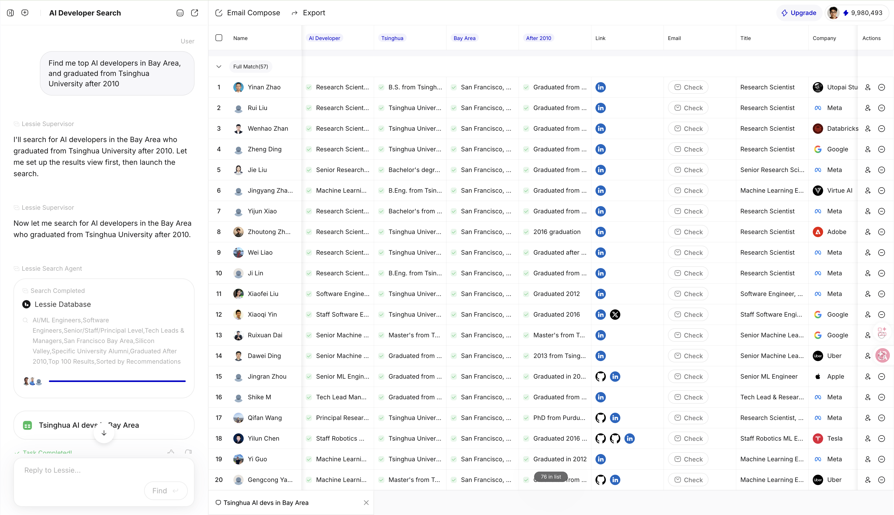

<h1 align="center">People Search Bench</h1>

<p align="center">
  <b>The first open benchmark for AI-powered people search agents</b>
</p>

<p align="center">
  <a href="https://arxiv.org/abs/2603.27476"></a>
  <a href="#leaderboard"></a>
  <a href="#methodology"></a>
  <a href="#contribute"></a>
  <a href="LICENSE"></a>
</p>

<p align="center">
  <a href="#leaderboard">Leaderboard</a> •
  <a href="#why-this-matters">Why It Matters</a> •
  <a href="#methodology">Methodology</a> •
  <a href="#contribute">Contribute</a>
</p>

---

## 🎯 Why This Matters
AI-powered people search is a rapidly growing category, yet there is no established benchmark to objectively compare platforms. People Search Bench fills this gap with a rigorous, transparent, and reproducible methodology.

People Search Bench provides a standardized, reproducible evaluation framework for comparing how well AI platforms can find real people matching natural language queries. We evaluate across **three scientifically grounded dimensions — Relevance, Precision, Effective Coverage, and Information Utility — using Criteria-Grounded Verification with web-based fact-checking**.

## Leaderboard

Evaluated on **119 queries** across 4 categories. All scores are on a 0-100 scale. See [Methodology](#methodology) for how each score is computed.
<p align="center">
  
</p>

| Platform | Relevance Precision | Effective Coverage | Information Utility | **Overall** |
|----------|:-------------------:|:------------------:|:-------------------:|:-----------:|
| **Lessie** | **70.2** | **69.1** | **56.4** | **65.2** |
| Exa | 53.8 | 58.1 | 53.1 | 55.0 |
| Claude Code | 54.3 | 41.1 | 42.7 | 46.0 |
| Juicebox (PeopleGPT) | 44.7 | 41.8 | 50.9 | 45.8 |

> **Lessie ranks #1 overall (65.2)**, with an 18.5% lead over Exa. Lessie achieves the highest Relevance Precision (70.2), Coverage (69.1), and Information Utility (56.4) while maintaining 100% task completion across 119 queries.

**Platform notes:**
- **Juicebox** is a specialized AI recruiting platform with 800M+ candidate profiles. It ranks **#2 in Recruiting** (Overall 65.7, ahead of Exa's 64.7), with the highest Utility (55.8) and Coverage (75.3) in that category. Its lower scores on Expert and KOL queries reflect the platform's recruiting-focused design.
- **Claude Code** is a general-purpose AI coding agent, not a specialized people search tool. It achieves reasonable Relevance Precision (54.3) but lower Coverage (41.1) — it finds fewer people per query. Its Information Utility is lowest (42.7) because its markdown reports lack structured contact data (email, LinkedIn, phone) and per-criterion verification evidence.
- Relevance Precision uses **padded nDCG@10**: the ideal DCG always assumes 10 perfectly relevant results are achievable, so platforms returning fewer results are scored relative to the full potential — not just what they returned.

<details>
<summary><b>How scores are computed</b></summary>

Each dimension produces a 0-100 score using the [Criteria-Grounded Verification](#methodology) pipeline:

- **Relevance Precision (padded nDCG@10)**: For each query, the LLM extracts checkable criteria from the search intent. Each returned person is verified against these criteria via web search, producing a relevance grade (0.0–1.0). We use **padded nDCG@10**: the ideal DCG always assumes 10 perfectly relevant results are achievable, so a platform returning only 3 perfect results scores lower than one returning 10. This prevents platforms that return few-but-perfect results from inflating their score.

- **Effective Coverage**: Counts the number of people with relevance_grade >= 0.5 per query (qualified results), combined with task completion rate. Formula: `TCR × mean(min(qualified_count / K, 1.0)) × 100`.

- **Information Utility**: Combines three equally weighted sub-scores, all assessed by an LLM from the raw result data: (1) **Profile Completeness** — how rich the person's data is (name, title, company, contact info, work history); (2) **Query-Specific Evidence** — does the result include per-criterion verification, match explanations, or source links showing *why* this person matches the query; (3) **Actionability** — can the user take next steps (contact, shortlist) based on this data alone. Formula: `(structural + evidence + actionability) / 3`.

- **Overall**: Equal-weight average of all three dimensions, following the standard multi-criteria decision analysis principle (Dawes, 1979).

</details>

<details>
<summary><b>Results by Scenario</b></summary>

#### Overall by Scenario

| Scenario | Queries | Lessie | Exa | Juicebox | Claude Code |
|----------|:-------:|:------:|:---:|:--------:|:-----------:|
| Recruiting | 30 | **68.2** | 64.7 | 65.7 | 50.5 |
| B2B Prospecting | 32 | **60.6** | 55.2 | 51.4 | 43.0 |
| Expert / Deterministic | 28 | **70.4** | 61.2 | 44.2 | 57.0 |
| Influencer / KOL | 29 | **62.3** | 41.6 | 31.1 | 43.2 |

#### Relevance Precision (padded nDCG@10)

| Scenario | Lessie | Exa | Juicebox | Claude Code |
|----------|:------:|:---:|:--------:|:-----------:|
| Recruiting | **74.8** | 66.2 | 66.1 | 59.0 |
| B2B Prospecting | **62.8** | 50.0 | 46.1 | 43.0 |
| Expert / Deterministic | **79.0** | 61.6 | 39.0 | 69.6 |
| Influencer / KOL | **65.2** | 37.4 | 26.6 | 46.9 |

#### Effective Coverage

| Scenario | Lessie | Exa | Juicebox | Claude Code |
|----------|:------:|:---:|:--------:|:-----------:|
| Recruiting | 75.6 | 73.8 | **75.3** | 46.7 |
| B2B Prospecting | **63.5** | 58.5 | 52.7 | 42.3 |
| Expert / Deterministic | **75.2** | 69.0 | 46.9 | 62.9 |
| Influencer / KOL | **62.8** | 39.3 | 22.8 | 39.3 |

#### Information Utility

| Scenario | Lessie | Exa | Juicebox | Claude Code |
|----------|:------:|:---:|:--------:|:-----------:|
| Recruiting | 54.3 | 54.0 | **55.8** | 45.8 |
| B2B Prospecting | 55.5 | **57.0** | 55.4 | 43.6 |
| Expert / Deterministic | **57.1** | 52.9 | 46.8 | 38.5 |
| Influencer / KOL | **58.9** | 48.0 | 44.0 | 43.4 |

**Key observations:**
- **Lessie ranks #1 Overall in all 4 categories**, with the highest Relevance Precision across the board.
- **In Recruiting, Juicebox ranks #2** (65.7) ahead of Exa (64.7), with the highest Coverage (75.3) and Utility (55.8) in that category — its 800M+ professional profile database gives it an edge.
- **Lessie leads Information Utility in Expert (57.1) and KOL (58.9)** queries, thanks to per-criterion checkpoint verification with source evidence.
- **Claude Code scores lowest in Recruiting and B2B** — its general-purpose approach struggles with domain-specific people search.
- **Lessie is the only platform with 100% task completion rate** and >62% Coverage across all categories.

</details>

---

## Case Studies

Challenging, cross-domain queries that test the boundaries of AI people search. These are **supplementary examples** evaluated independently from the 119-query benchmark dataset, included to illustrate qualitative differences between platforms.

<details>
<summary><b>Case 1: Rising Stars in LLM Safety & Alignment</b> — Academic + Publication Cross-Reference</summary>

**Query**: *"Who are the rising stars in the large language model safety and alignment field? I want people who started publishing after 2021 and already have 3+ first-author papers at top venues."*
([View Lessie results](https://s6.jennie.im/find/39ce1452-39ea-407f-afcd-621529d18aa6))

Requires cross-referencing **publication databases** with **career profiles** — testing multi-source data fusion.

| Platform | Relevance | Coverage | Utility | Qualified |
|----------|:---------:|:--------:|:-------:|:---------:|
| **Lessie** | **100.0** | **100.0** | 28.9 | 15/15 |
| Claude Code | 79.6 | 73.3 | **52.5** | 11/12 |
| Juicebox | 71.7 | 86.7 | 54.0 | 13/15 |
| Exa | 65.1 | 93.3 | 42.7 | 14/15 |

</details>

<details>
<summary><b>Case 2: Brazilian Beauty Micro-Influencers on Instagram</b> — 5-Constraint Social Search</summary>

**Query**: *"Brazilian beauty niche influencers who talk about hair, hair loss, etc... with between 5k to 30k followers on Instagram, and who have a highly engaged audience"*
([View Lessie results](https://s6.jennie.im/find/c0213aa8-3a1f-44ca-89a1-ec87899daa7a))

5 simultaneous constraints: **geography** (Brazil) + **platform** (Instagram) + **niche** (hair/beauty) + **follower range** (5K-30K) + **engagement quality**.

| Platform | Relevance | Coverage | Utility | Qualified |
|----------|:---------:|:--------:|:-------:|:---------:|
| **Lessie** | **99.1** | **100.0** | 33.3 | 15/15 |
| Exa | 67.0 | 86.7 | **39.8** | 13/15 |
| Claude Code | 59.7 | 46.7 | 23.3 | 7/7 |
| Juicebox | 22.8 | 6.7 | 25.8 | 1/15 |

</details>

<details>
<summary><b>Case 3: Tsinghua Grads in Bay Area AI</b> — Education + Geography + Industry Intersection</summary>

**Query**: *"Find me top AI developers in Bay Area, and graduated from Tsinghua University after 2010"*
([View Lessie results](https://s6.jennie.im/find/b4ba6f24-a319-4ff7-8565-e23d45cebdcd))

4 constraints: **geography** + **profession** + **education** + **temporal** — testing alumni network data access.

| Platform | Relevance | Coverage | Utility | Qualified |
|----------|:---------:|:--------:|:-------:|:---------:|
| **Lessie** | **97.8** | **100.0** | 29.6 | 15/15 |
| Claude Code | 78.6 | 46.7 | 1.0 | 7/7 |
| Juicebox | 76.2 | 93.3 | **33.3** | 14/15 |
| Exa | 69.0 | 80.0 | 33.3 | 12/15 |

</details>

<details>
<summary><b>Case 4: AI Agent Startup Founders (2025 Funded)</b> — Abstract Discovery + Funding Data</summary>

**Query**: *"Map the key people behind the top AI agent startups funded in 2025. For each company give me the founding team, their backgrounds, and any shared alumni networks."*
([View Lessie results](https://s6.jennie.im/find/5657dc0a-fed0-4395-881c-d43e621dce78))

Requires synthesis of **venture funding data** + **company databases** + **founder profiles**.

| Platform | Relevance | Coverage | Utility | Qualified |
|----------|:---------:|:--------:|:-------:|:---------:|
| Claude Code | **92.5** | **100.0** | 30.2 | 15/15 |
| **Lessie** | 78.9 | **100.0** | **66.0** | 15/15 |
| Exa | 69.5 | 86.7 | 51.6 | 13/15 |
| Juicebox | 52.5 | 60.0 | 49.1 | 9/15 |

</details>

<details>
<summary><b>Case 5: Agricultural Scientists in Africa</b> — Non-LinkedIn Domain</summary>

**Query**: *"Find agricultural scientists in Africa working on food security, crop science, or sustainable farming"*
([View Lessie results](https://s6.jennie.im/find/6dd84810-c663-426e-b2c3-0ecfee47a893))

Tests coverage in a domain where most professionals are indexed in **institutional databases**, not professional social platforms.

| Platform | Relevance | Coverage | Utility | Qualified |
|----------|:---------:|:--------:|:-------:|:---------:|
| Exa | **97.6** | **100.0** | **61.8** | 15/15 |
| Claude Code | 96.8 | 80.0 | 13.6 | 12/12 |
| Juicebox | 94.8 | **100.0** | 66.4 | 15/15 |
| **Lessie** | 93.4 | **100.0** | 33.3 | 15/15 |

</details>

<details>
<summary><b>Case 6: NLP Academics Turned Industry Practitioners</b> — Cross-Profile Identity</summary>

**Query**: *"Find people who have both a strong academic publication record in NLP and also hold senior engineering positions at tech companies."*
([View Lessie results](https://s6.jennie.im/find/3e24ec28-a6da-423f-81ee-10b7a9072566))

Requires the intersection of **two distinct professional identities**.

| Platform | Relevance | Coverage | Utility | Qualified |
|----------|:---------:|:--------:|:-------:|:---------:|
| Juicebox | **100.0** | **100.0** | 33.3 | 15/15 |
| **Lessie** | 95.6 | **100.0** | **33.1** | 15/15 |
| Claude Code | 92.6 | **100.0** | 24.9 | 15/15 |
| Exa | 73.8 | 86.7 | 33.3 | 13/15 |

</details>

<details>
<summary><b>Case 7: Google DeepMind Talent Flow</b> — Temporal Career Intelligence</summary>

**Query**: *"Find engineers who recently mass-departed from Google DeepMind in the last 6 months and identify where they went."*
([View Lessie results](https://s6.jennie.im/find/0d0cf734-11d8-4b70-bf0b-721e188ff1c8))

Tests **temporal career change detection** — who left, when, and where they went.

| Platform | Relevance | Coverage | Utility | Qualified |
|----------|:---------:|:--------:|:-------:|:---------:|
| **Lessie** | **100.0** | **100.0** | **60.2** | 15/15 |
| Claude Code | 92.3 | 86.7 | 22.6 | 13/13 |
| Juicebox | 44.4 | 66.7 | 34.4 | 10/15 |
| Exa | 37.8 | 73.3 | 34.4 | 11/15 |

</details>

<details>
<summary><b>Case 8: UK Film Prop Companies Needing CNC Services</b> — Niche B2B Prospecting</summary>

**Query**: *"Find me UK film prop or event prop companies who would require an outsourced CNC service"*
([View Lessie results](https://s6.jennie.im/find/f4b157bd-5e9c-4310-9752-b680cde2efd8))

A hyper-specific **niche B2B** query with an inferred need (CNC outsourcing).

| Platform | Relevance | Coverage | Utility | Qualified |
|----------|:---------:|:--------:|:-------:|:---------:|
| **Lessie** | **87.5** | **100.0** | **56.9** | 15/15 |
| Juicebox | 66.7 | 60.0 | 52.2 | 9/15 |
| Exa | 53.7 | 66.7 | 56.0 | 10/15 |
| Claude Code | 19.3 | 6.7 | 0.0 | 1/1 |

</details>

---

## What Sets Lessie Apart

### 1. Multi-Source Data Fusion

Lessie searches across **professional networks, social platforms (Instagram, Twitter/X), academic databases, institutional websites, venture funding records, and public registries** — producing results that no single-source platform can match:

- Academic profiles with publication records ([Case 1](https://s6.jennie.im/find/39ce1452-39ea-407f-afcd-621529d18aa6))
- Instagram-native influencer profiles with engagement data ([Case 2](https://s6.jennie.im/find/c0213aa8-3a1f-44ca-89a1-ec87899daa7a))
- Institutional researchers in regions with low LinkedIn penetration ([Case 5](https://s6.jennie.im/find/6dd84810-c663-426e-b2c3-0ecfee47a893))
- Temporal career change data for talent flow analysis ([Case 7](https://s6.jennie.im/find/0d0cf734-11d8-4b70-bf0b-721e188ff1c8))

[](https://s6.jennie.im/find/69d54188-a8ec-4f81-8f22-fb892e3d0b30)

### 2. Cross-Scenario Consistency

Lessie is the only platform that maintains **consistent Relevance Precision across all query categories** (range: 62.8–79.0). Other platforms show significant variance: Juicebox ranges from 26.6 to 66.1, Exa from 37.4 to 66.2.

### 3. Per-Result Match Explanations

For every person returned, Lessie provides a **structured explanation** of why this person matches the query — increasing Information Utility by enabling immediate actionability without manual profile review.

[](https://s6.jennie.im/find/78a412f1-2da5-4acc-9b7b-4baecf5d328e)

### 4. Intelligent Search Planning

Lessie's AI agent decomposes complex queries into sub-tasks, plans search strategies across multiple data sources, and iteratively refines results. The planning process is transparent to users.

[](https://s6.jennie.im/find/3a73b8ea-3cfb-4f6e-8725-3666b1a00960)

---

<details>
<summary><b>Additional Screenshots</b></summary>

### AI KOL Discovery on Twitter/X

[](https://s6.jennie.im/find/89e16d5a-d310-4a74-be09-0b8047785126)

### Mental Health Conference Sponsor Search (Ottawa, Canada)

[](https://s6.jennie.im/find/c6158f1f-1a18-4438-8ef2-896137de0e66)

### Historical Leadership Lookup (Apple CTOs)

[](https://s6.jennie.im/find/63d4e00e-6bf6-4b9c-b8a9-4d63f00c6c51)

### Tsinghua AI Developers in Bay Area

[](https://s6.jennie.im/find/b4ba6f24-a319-4ff7-8565-e23d45cebdcd)

</details>

---

## 🧪 Methodology

<p align="center">
  
</p>

### How It Works

Every score is backed by **verifiable web evidence** — not subjective LLM judgments.

```
Query ──→ Extract Criteria ──→ Verify via Web ──→ Grade ──→ Aggregate
         (N checkable items)    (Tavily API)      (0/0.5/1)   (nDCG + Coverage + Utility)
```

**Example:**
> **Query:** "Find senior ML engineers at Google in Bay Area"  
> **Criteria:** ① Senior ML Engineer ② At Google ③ Bay Area  
> **Jane Doe:** ① ✓ ② ✓ ③ ✗ → **relevance_grade = 2/3 = 0.67**

---

### Scoring Formula

| Metric | Formula | Description |
|:-------|:--------|:------------|
| **Relevance Precision** | `padded nDCG@10` | Quality & ranking. Ideal DCG assumes 10 perfect results — returning only 3 perfect results scores lower. |
| **Accuracy** | `met_criteria / total_criteria` | % of criteria verified via web sources |
| **Information Utility** | `(completeness + evidence + actionability) / 3` | Profile richness + match explanations + immediate actionability |
| **Coverage** | `min(qualified_results / K, 1.0) × 100` | How many qualified results (grade ≥ 0.5), capped at K=10 |
| **Overall** | `avg(Relevance, Accuracy, Utility, Coverage)` | Equal-weight average |

---

### Why Our Approach?

| Issue | Traditional LLM-as-Judge | ✅ Our Solution |
|:------|:-------------------------|:----------------|
| **Subjectivity** | Vague quality scores | Binary factual checks |
| **Evidence** | Stale parametric knowledge | Live web verification |
| **Reproducibility** | Prompt-sensitive | Explicit, fixed criteria |
| **Bias** | Style/length bias | Verifiable facts only |

---

<details>
<summary><b>Query Design</b></summary>

The benchmark comprises 119 queries balanced across four categories (28–32 per category) and multiple languages (English, Portuguese, Spanish, Dutch). Queries are designed to reflect real-world people search needs spanning professional recruiting, B2B prospecting, domain expert lookup, and influencer discovery.

</details>

---

## Query Categories

| Category | Queries | Description | Example |
|----------|:-------:|-------------|---------|
| **Recruiting** | 30 | Candidates with specific skills, experience, location | "Find backend developers in London with microservices experience" |
| **B2B Prospecting** | 32 | Decision-makers at target companies | "Find corporate innovation leaders in Europe at large enterprises" |
| **Expert / Deterministic** | 28 | Queries with verifiable correct answers or that seek specific domain experts | "Find all co-founders of Together AI", "List all research scientists at OpenAI" |
| **Influencer / KOL** | 29 | Content creators and opinion leaders | "Find AI KOLs with 10K+ followers on Twitter" |

The full query set is available in [`data/queries/`](data/queries/).

## Platforms Evaluated

| Platform | Type | Data Sources | Strength |
|----------|------|-------------|----------|
| [Lessie](https://lessie.ai) | AI Agent | Multi-source (web, social, professional, academic) | Broad coverage, cross-domain consistency |
| [Exa](https://exa.ai) | Search API | Structured entity database | Structured professional data |
| [Juicebox (PeopleGPT)](https://juicebox.ai) | AI Recruiting | 800M+ profiles, 60+ sources | Deep recruiting / professional profiles |
| [Claude Code](https://claude.ai) | General AI Agent | Web search | High precision on specific queries |

---

## Data & Reproducibility

### What's in this repository

- **Benchmark queries** (`data/queries/`) — all search prompts used in the evaluation
- **Evaluation methodology** — scoring formulas, criteria extraction, and aggregation logic
- **Aggregated platform scores** — the leaderboard numbers, verifiable against the methodology

### What's NOT in this repository

Raw search results and per-person evaluations are **excluded for privacy and compliance reasons**. These files contain real personal information (names, titles, companies, contact details) returned by each platform.

### How the benchmark works

1. **Collect results**: Run each benchmark query on each platform, collect the returned people and their structured data into CSV files.
2. **Evaluate**: Run the Criteria-Grounded Verification pipeline — extract criteria from each query, verify each person against criteria via web search, compute relevance grades.
3. **Score**: Aggregate per-person grades into platform-level scores using nDCG@K, Effective Coverage, and Information Utility.

The evaluation pipeline code and query definitions are open-source. The raw personal data is not.

---

## Citation

```bibtex
@misc{lessieai2026peoplesearchbench,
  title={People Search Bench: A Benchmark for Evaluating AI-Powered People Search Agents},
  author={LessieAI},
  year={2026},
  eprint={2603.27476},
  archivePrefix={arXiv},
  url={https://arxiv.org/abs/2603.27476}
}
```

## Disclosure

This benchmark was designed, developed, and maintained by [LessieAI](https://lessie.ai), which is also one of the evaluated platforms. To mitigate potential bias:

- All evaluation code and query definitions are **open-source** and auditable.
- Scoring uses **external web verification** (Tavily API), not LLM parametric knowledge.
- The same evaluation pipeline and LLM model are applied **identically** to all platforms.
- Aggregated scores are published alongside the methodology so results can be independently verified.

We welcome third-party reproductions and encourage other platforms to [submit their results](docs/submission_guide.md) for independent evaluation.

## License

MIT License. See [LICENSE](LICENSE).

## Acknowledgments

- Evaluation methodology grounded in [MT-Bench](https://arxiv.org/abs/2306.05685) (Zheng et al., 2023), nDCG (Jarvelin & Kekalainen, 2002), and MCDA (Dawes, 1979)
- Web verification powered by [Tavily](https://tavily.com) -- LLM evaluation via [OpenRouter](https://openrouter.ai)


